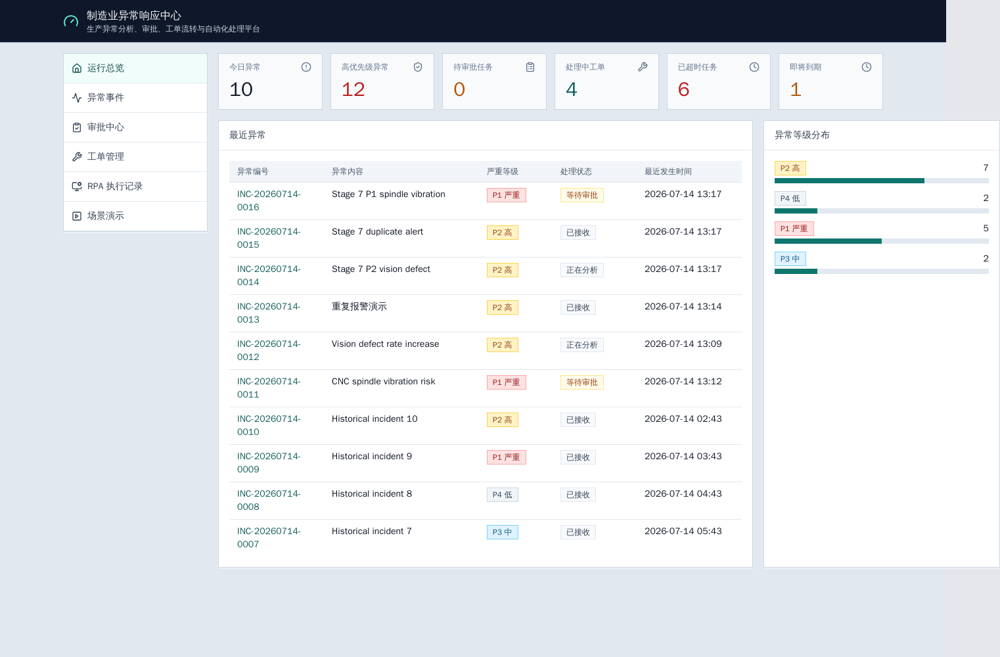
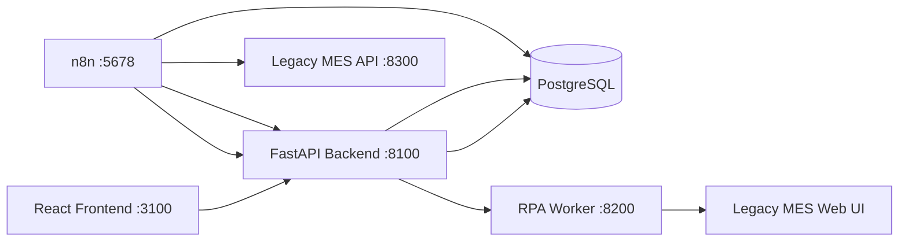

# 制造业异常响应中心

这是一个可以在本机用 Docker Compose 启动的制造业异常处理演示系统。它展示了设备报警从进入系统开始，如何完成去重、上下文查询、Agent 辅助分析、确定性严重等级判断、n8n 工作流编排、人工审批、工单创建、MES API 失败后切换到 Playwright RPA，以及最终沉淀为知识案例的完整闭环。

项目定位是简历和面试演示用的完整工程样例。它不会连接真实 PLC、机器人、生产 MES/ERP、企业聊天工具或任何物理设备控制系统。

## 效果预览



上图是从正在运行的 Docker Compose 前端中截取的真实页面，数据来自后端 API，不是静态 mock 图。

## 业务价值

制造现场的异常处理通常分散在操作员、Excel 表、MES 页面、维修团队和临时审批流程之间，容易出现响应慢、重复建单、过程不可追踪等问题。本项目演示了一套更可靠的异常响应流程：

1. 接收异常并识别重复报警。
2. 补充设备、批次和维修历史上下文。
3. 使用可审计的 Agent 分析可能原因和处理建议。
4. 由确定性规则决定最终严重等级和是否需要审批。
5. 用 n8n 编排长流程、人工等待和 SLA 升级。
6. 优先通过 MES API 创建工单；只有技术故障时才降级使用 Playwright RPA。
7. 追踪 SLA、处理时间线、通知、RPA 截图和结案知识。

## Architecture



Responsibility split:

- FastAPI owns domain state, validation, dedupe, state machines, SLA, agent audit records, protected resume URLs, public APIs, and internal APIs.
- n8n owns orchestration, Wait-based approval pause/resume, SLA scans, workflow events, and cross-service branching.
- Agent adapter and Demo Analyzer provide structured analysis only. They do not create work orders, change severity directly, or perform equipment actions.
- Deterministic rules decide final severity and human approval requirements.
- RPA Worker operates the simulated MES web pages only when the MES API has a technical failure. It does not hide 4xx business validation errors.
- React reads public backend APIs only. It does not receive internal service tokens or n8n resume URLs.

## Services

| Service | Default URL | Purpose |
|---|---|---|
| frontend | `http://localhost:3100` | Operations dashboard and demo UI |
| backend | `http://localhost:8100` | FastAPI public/internal API |
| backend OpenAPI | `http://localhost:8100/docs` | API documentation |
| n8n | `http://localhost:5678` | Workflow editor/runtime |
| legacy MES | `http://localhost:8300/login` | Simulated old MES web UI |
| RPA Worker | `http://localhost:8200/ready` | Playwright automation API |
| PostgreSQL | Docker network only | Business and n8n persistence |

Default ports are configurable through `.env`.

## Tech Stack

- Backend: Python 3.11, FastAPI, Pydantic v2, SQLAlchemy 2, Alembic, PostgreSQL, pytest.
- Workflows: n8n with PostgreSQL persistence.
- RPA: Python, FastAPI, Playwright Chromium.
- Simulated MES: Python FastAPI with server-rendered HTML.
- Frontend: React, TypeScript, Vite, React Router, TanStack Query, Tailwind CSS, Vitest, ESLint.
- Runtime: Docker Compose on Windows 11 with PowerShell and Docker Desktop.

## Directory Guide

```text
backend/       FastAPI app, domain services, Alembic migrations, tests
frontend/      React dashboard and frontend tests
legacy-mes/    Simulated MES API and web pages
rpa-worker/    Playwright RPA worker and tests
n8n/workflows/ Six importable workflow JSON files
scripts/       PowerShell workflow import and smoke test scripts
docs/          Architecture, workflow, API, demo, and acceptance docs
```

## Quick Start

Prerequisites:

- Docker Desktop running.
- Docker Compose CLI available.
- Node.js/npm available for local frontend commands.
- PowerShell 5+ or PowerShell 7.

Start the full stack:

```powershell
Copy-Item .env.example .env
docker compose up -d --build
docker compose ps
docker compose exec -T backend alembic upgrade head
docker compose exec -T backend python -m factory_hub.seed
.\scripts\import-n8n-workflows.ps1
docker compose exec -T n8n n8n update:workflow --id=wf-01-incident-intake-analysis --active=true
docker compose exec -T n8n n8n update:workflow --id=wf-02-critical-incident-approval --active=true
docker compose exec -T n8n n8n update:workflow --id=wf-03-work-order-api-rpa-fallback --active=true
docker compose exec -T n8n n8n update:workflow --id=wf-04-sla-escalation-monitor --active=true
docker compose exec -T n8n n8n update:workflow --id=wf-05-incident-closure-knowledge --active=true
docker compose exec -T n8n n8n update:workflow --id=wf-99-global-error-handler --active=true
docker compose restart n8n
```

For a full automated validation, run:

```powershell
powershell -ExecutionPolicy Bypass -File .\scripts\smoke-test.ps1
```

## Configuration

Use `.env.example` as the template. Do not commit `.env`.

Important variables:

- `BACKEND_PORT`, `FRONTEND_PORT`, `N8N_PORT`, `LEGACY_MES_PORT`, `RPA_WORKER_PORT`.
- `POSTGRES_DB`, `POSTGRES_USER`, `POSTGRES_PASSWORD`.
- `INTERNAL_SERVICE_TOKEN`.
- `N8N_ENCRYPTION_KEY`, `N8N_BASIC_AUTH_USER`, `N8N_BASIC_AUTH_PASSWORD`.
- `LLM_DEMO_MODE`, `LLM_API_KEY`, `LLM_BASE_URL`, `LLM_MODEL`, `LLM_TIMEOUT`.
- `VIBRATION_P1_THRESHOLD`, `TEMPERATURE_P1_THRESHOLD`, `DEFECT_RATE_P2_THRESHOLD`.
- `MES_FAILURE_MODE`, `RPA_HEADLESS`, `RPA_TIMEOUT_MS`.

With no LLM key, `LLM_DEMO_MODE=true` keeps analysis deterministic and testable.

## Migrations And Seed Data

```powershell
docker compose exec -T backend alembic current
docker compose exec -T backend alembic upgrade head
docker compose exec -T backend python -m factory_hub.seed
docker compose exec -T backend python -m factory_hub.seed
```

The seed command is idempotent and can be run repeatedly.

## Demo Scenarios

The frontend Demo page exposes four real flows:

- CNC spindle vibration P1.
- Vision defect rate P2.
- Duplicate alarm dedupe.
- MES API failure with RPA fallback.

Direct full-stack validation:

```powershell
powershell -ExecutionPolicy Bypass -File .\scripts\smoke-test.ps1
```

See [docs/demo-guide.md](docs/demo-guide.md) for a guided demo script.

## Tests And Builds

Backend and service tests:

```powershell
docker compose exec -T backend python -m pytest -q
docker compose exec -T legacy-mes python -m pytest -q /app/legacy-mes/tests
docker compose exec -T rpa-worker python -m pytest -q /app/rpa-worker/tests
```

Frontend:

```powershell
cd frontend
npm.cmd ci
npm.cmd run lint
npm.cmd test -- --run
npm.cmd run build
```

End-to-end smoke:

```powershell
cd ..
powershell -ExecutionPolicy Bypass -File .\scripts\smoke-test.ps1
```

## Troubleshooting

- Docker permission errors: ensure Docker Desktop is running and the current user can access the Docker engine.
- `npm.ps1` blocked by PowerShell: use `npm.cmd` or `cmd /c npm ...`.
- n8n webhooks return 404: re-import workflows, activate the six workflow IDs, then `docker compose restart n8n`.
- Legacy MES root returns 404: use `http://localhost:8300/login`.
- Vitest/Vite `EPERM` on Windows in restricted shells: rerun with a shell that can create temporary config files in `frontend/`.
- RPA failures: check `docker compose logs rpa-worker` and the controlled screenshot endpoint under `/api/rpa-runs/{id}/screenshot`.

## Security Notes

- `.env` is ignored; `.env.example` contains local demo defaults and example values only.
- Public frontend APIs do not expose internal service tokens or n8n resume URLs.
- Logs and workflow error payloads redact tokens, passwords, model keys, and resume URLs.
- RPA screenshots are stored in a Docker volume and exposed through a controlled backend endpoint, not arbitrary host paths.

## Known Limits

- Local demo auth is intentionally simple and not enterprise RBAC.
- n8n activation uses `update:workflow` in the verified n8n version; future versions may require `publish:workflow` or UI activation.
- CI runs unit/build checks and does not run full Docker+n8n browser E2E.
- The system does not control real equipment.

## Further Documentation

- [Architecture](docs/architecture.md)
- [Workflow Design](docs/workflow-design.md)
- [API Design](docs/api-design.md)
- [Demo Guide](docs/demo-guide.md)
- [Technical Review Guide](docs/technical-review-guide.md)
- [Final Acceptance Report](docs/final-acceptance-report.md)
