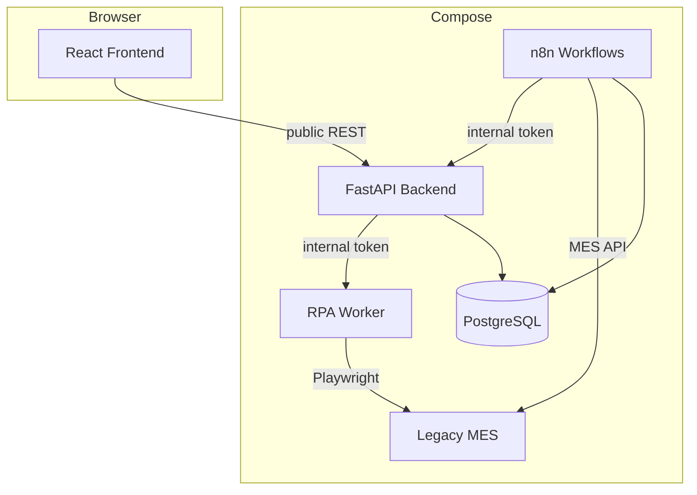
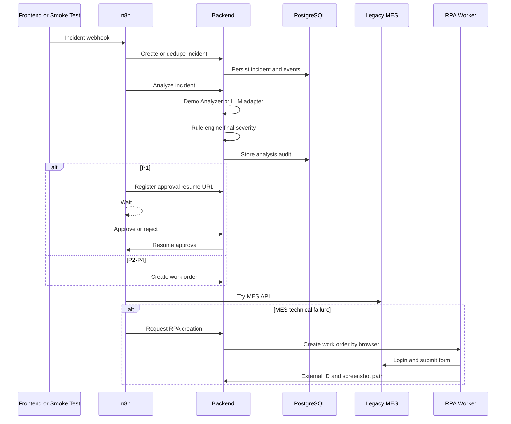

# Architecture

## Overview

Factory Incident Response Hub is a local distributed demo with one business database and several bounded services. The system favors explicit service boundaries over hidden side effects:

- Backend controls business state.
- n8n controls orchestration and waits.
- RPA Worker controls browser automation.
- Legacy MES provides a realistic target for API and browser fallback.
- Frontend observes and acts through public backend APIs.

## Core Data Flow

## Service Boundaries

Backend:

- SQLAlchemy models and Alembic migrations.
- Dedupe, numbering, state transitions, SLA calculations.
- Agent input/output validation, retry, fallback, and audit.
- Rule engine final severity and approval requirement.
- Public APIs for frontend and protected internal APIs for n8n/RPA.
- Resume URL protection and redaction.

n8n:

- Receives webhook-triggered workflows.
- Calls backend internal APIs with `INTERNAL_SERVICE_TOKEN`.
- Waits for human approval.
- Routes MES API success, business error, and technical failure.
- Records workflow events and sanitized errors.

RPA Worker:

- Receives protected backend calls.
- Uses Playwright Chromium in a fresh browser context per run.
- Logs high-level steps without credentials.
- Saves success/failure screenshots to a Docker volume.

Legacy MES:

- Provides login, list, create, and detail pages.
- Provides an API with controllable normal, 4xx, 503, and timeout behavior.
- Failure mode is controlled through a protected internal demo endpoint.

Frontend:

- Uses public backend APIs only.
- Does not store internal tokens.
- Does not display n8n resume URLs.

## Persistence

- `postgres_data`: business database plus a separate `n8n` database.
- `n8n_data`: n8n local runtime data.
- `rpa_artifacts`: RPA screenshots and browser artifacts.

`docker compose down` keeps named volumes. Use `docker compose down -v` only when intentionally deleting local demo data.

## Security Model

- Internal APIs require `X-Internal-Token`.
- `.env` is ignored.
- `.env.example` values are invalid placeholders.
- Sensitive fields are redacted in backend logging and workflow error persistence.
- RPA screenshots are served through backend route checks, not by exposing arbitrary paths.

## Reliability Choices

- Compose health checks gate service startup.
- Smoke test uses bounded polling with timeout.
- Workflows are imported and activated before E2E validation.
- Duplicate incidents, duplicate approvals, repeated SLA scans, and restarts are covered by tests or smoke flow.
